# Landscape Water Levels

## Introduction

This is a web application that simulates the flow of water across different segments of a landscape. The idea is that a user can introduce a comma separated list of landscape segment levels and a number of hours to simulate, and start a simulation. The user will see the progress of the simulation and interact with it to pause, continue, or fast forward.

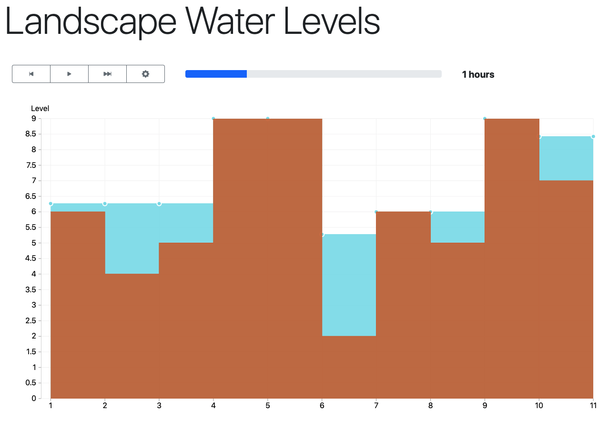

The main goal for me was to put in practice my skills with Rust, and build a WebSocket based service that required interactivity from the users. To that aim I decided to use the great [tokio-tungstenite] crate and leverage concurrency with [tokio], [futures] and `async/await`.

To make the exercise more visual and interactive, I also took the chance to learn a new technology and build a web fronted using [ELM]. Aside from this being the first time in my life working with ELM or writing Haskell code, I am not a professional frontend developer, so please take it with a grain of salt.

[tokio-tungstenite]: https://github.com/snapview/tokio-tungstenite/tree/master/examples
[tokio]: https://tokio.rs/
[futures]: https://docs.rs/futures/0.3.15/futures/
[ELM]: https://elm-lang.org/

## Software design

The application is divided in different parts:

- The **user interface** is a single page application that connects with the server through a WebSocket (see [frontend](frontend)).
- The **networking** part deals with WebSocket connections (see [main.rs](src/main.rs))
- The **protocol** part deals with the user interactions following a simple protocol that allows to start a simulation, pause and resume it, and fast forward it (see [protocol.rs](src/protocol.rs)).
- The **simulation** part encapsulates the simulation logic (see [simulation.rs](src/simulation.rs)).
- The **water_flow** part deals with the flow of water through a landscape (see [water_flow.rs](src/water_flow.rs)).

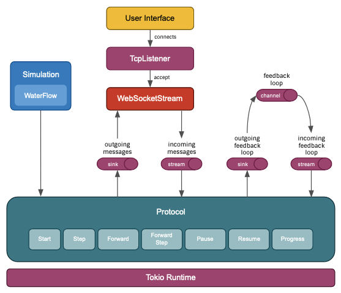

The protocol is abstracted out from the networking by using plain `futures` `Sink`s and `Stream`s that transport messages. To allow easy unit testing of the protocol, the internal events sent to itself (for example to signal that a new step needs to be simulated after a certain period of time) are delegated to a `Sink` and a `Stream`. They are created from a single `mpsc::channel` in runtime, but a couple of different channels for unit testing.

## The algorithm and its complexity

### Internal representation of a landscape

One of the key points of the algorithm is the representation of the `sinks` in the landscape as a hierarchical tree of nodes, each one containing information about:

- what region and levels of the landscape it covers.
- how much water it can contain.
- how much water it contains.
- its hierarchical relationship with other sinks, which determines how the water will flow and with what proportions.

For example, for the landscape `[6, 4, 5, 9, 9, 2, 6, 5, 9, 7]`, these are the nodes representing the sinks and the flow of water:

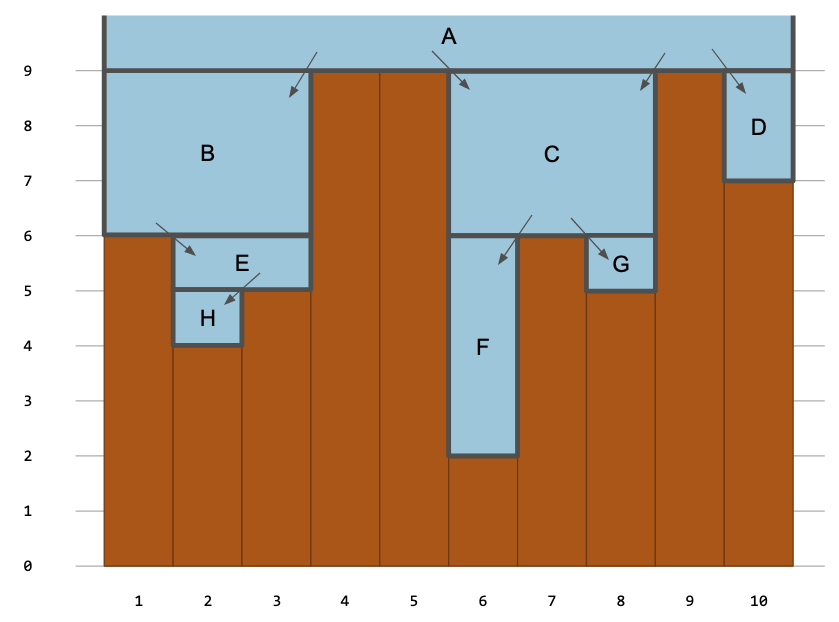

Which results in the following tree:

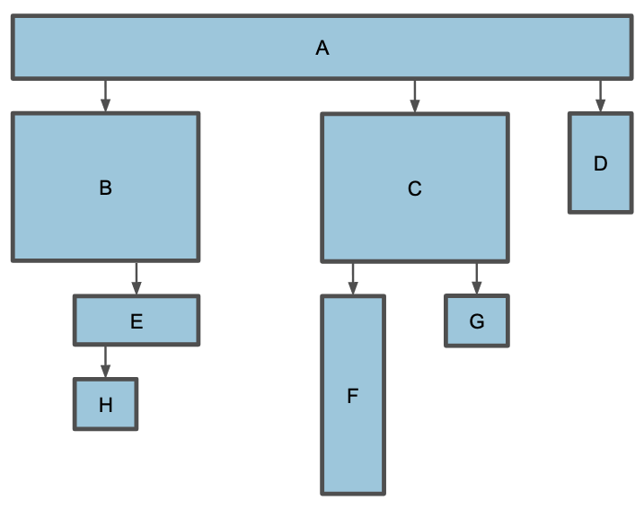

If we had some water accumulated in the sinks like in the following example:

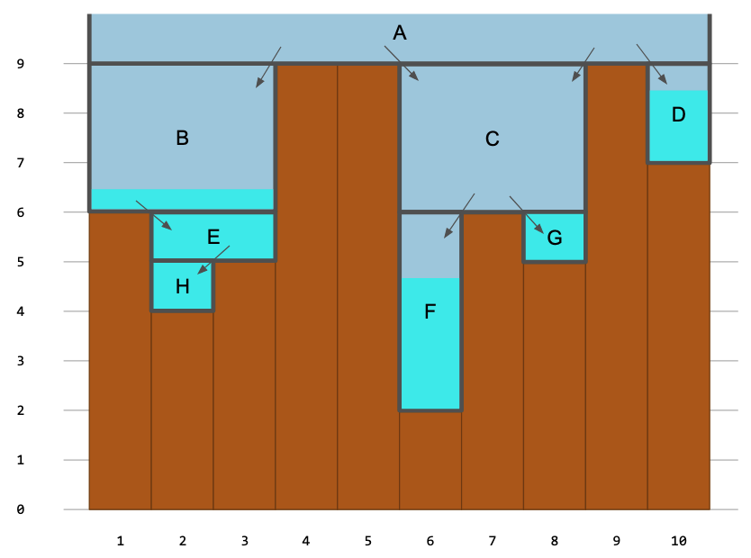

This would be the internal state of the tree:

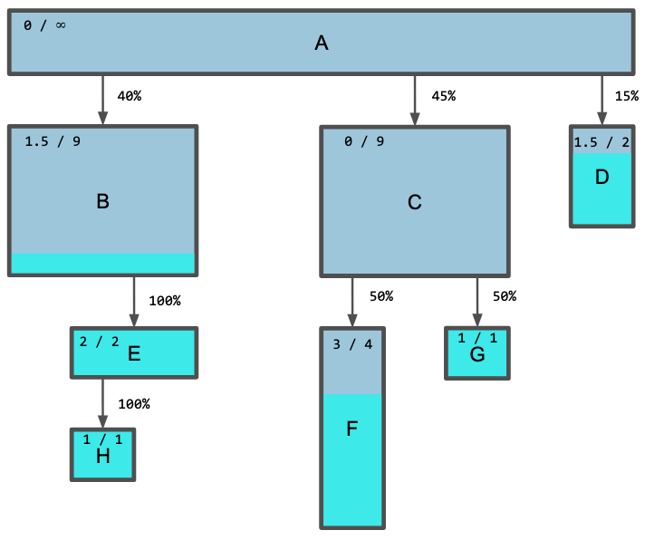


### Overall idea of the algorithm

The main parts of the algorithm are:

1. Creating the hierarchy of sinks
2. Filling the sinks bottom up
3. Spilling water into the siblings
4. Flooding the water contained in the sinks into the segments

Once a hierarchy of sinks has been created (1), it can be reused for simulating the rain multiple times (2 - 4).

The water will always flow from the root sink to the leafs, but it will fill the sinks from the bottom up.

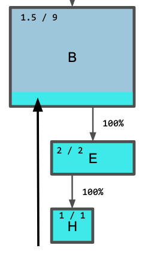

When one of the children sinks fills up, the excess of water will spill into the sibling sinks.

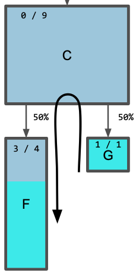

The spilling of water into the siblings will happen in both directions and following the right proportions according to the available capacity.

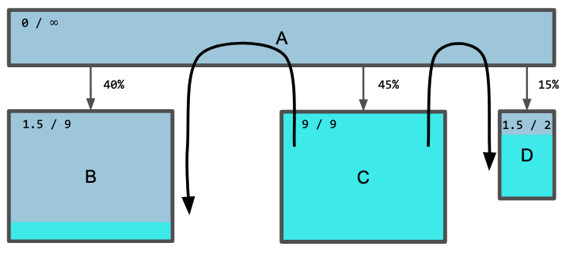

### Complexity

**Inputs:**

- **L** = The landscape segment levels for all the segments
- **h** = The number of hours to simulate

**Output:**

- The level of the water in the different segments

The algorithm can be expressed in pseudo-code (including the expansion of the key functions) like:

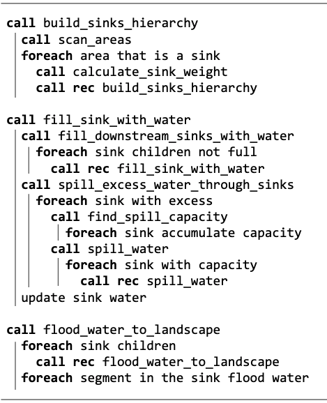

- Let `N` be the number of segments in a landscape.
- Let `A` be the number of areas for a certain level, which in the worst case will be `N+2`.
- Let `S` be the number of Sinks, which in the worst case will be `ceil(N/2)`.
- Let `log S` be the maximum height of the hierarchy tree.
- The complexity of the operation at the leaves of the recursion tree is constant time.
- The asymptotic complexity will depend on the individual complexities of each of the three parts of the algorithm (`build_sink_hierarchy`, `fill_sink_with_water`, `flood_water_to_landscape`).

**build_sink_hierarchy:**

```
T(build_sink_hierarchy) = T(scan_areas) + A * T(calculate_sink_weight) + A * T(build_sink_hierarchy)
```

Given that `scan_areas` is `O(N)`, and `calculate_sink_weight` is `O(1)`, and assuming that the longest path of a sink tree is logarithmic (the recursion), and substituting `A` by the worst case `N` (asymptotically speaking), we can rewrite it to:

```
T(build_sink_hierarchy) = O(N) + O(N) + O(N * log N)
T(build_sink_hierarchy) = O(N * log N)
```

**fill_sink_with_water:**

```
T(fill_sink_with_water) = T(fill_downstream_sinks_with_water) + T(spill_excess_water_through_sinks) + O(1)

T(fill_downstream_sinks_with_water) = S * T(fill_sink_with_water)
T(fill_downstream_sinks_with_water) = O(S * log S)
T(fill_downstream_sinks_with_water) = O(N * log N)

T(spill_excess_water_through_sinks) = S * (O(S) + S * T(fill_sink_with_water))
T(spill_excess_water_through_sinks) = S * (O(S) + O(S * log S))
T(spill_excess_water_through_sinks) = O(S^2) + O(S^2 * log S)
T(spill_excess_water_through_sinks) = O(N^2 * log N)

T(fill_sink_with_water) = O(N * log N) + O(N^2 * log N) + O(1)
T(fill_sink_with_water) = O(N^2 * log N)
```

**flood_water_to_landscape:**

```
T(flood_water_to_landscape) = S * T(flood_water_to_landscape) + O(S)
T(flood_water_to_landscape) = O(S * log S) + O(S)
T(flood_water_to_landscape) = O(S * log S)
T(flood_water_to_landscape) = O(N * log N)
```


**Final asymptotic complexity:**

```
O(N * log N) + O(N^2 * log N) + O(N * log N)
```

which results in

```
O(N^2 * log N)
```

### Test Cases

Here you will find some interesting test sets:

**This will spill the water from the center sinks towards the sides.**

```
0,9,1,9,2,9,3,9,4,9,5,9,6,9,7,9,8,9,8,9,7,9,6,9,5,9,4,9,3,9,2,9,1,9,0
```

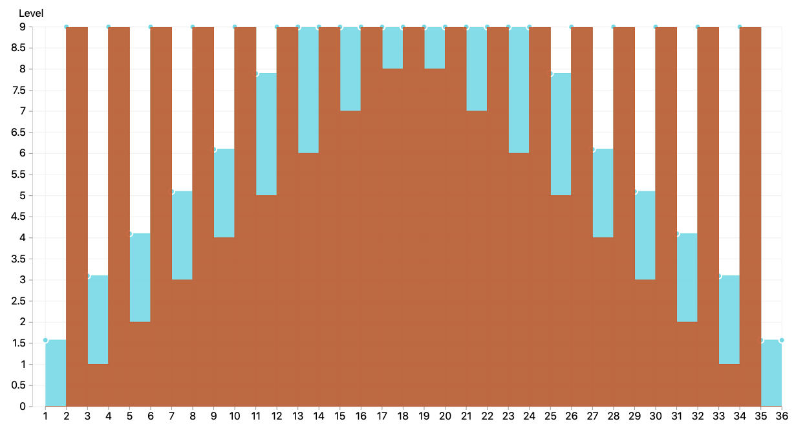

**This requires the water to spill and fill recursively down the hierarchy**

You can observe how the segments 7 and 13 spill into the center without filling 9 and 11 until 10 has not been filled to their level.

```
4,9,5,9,6,9,7,9,8,2,8,9,7,9,6,9,5,9,4
```

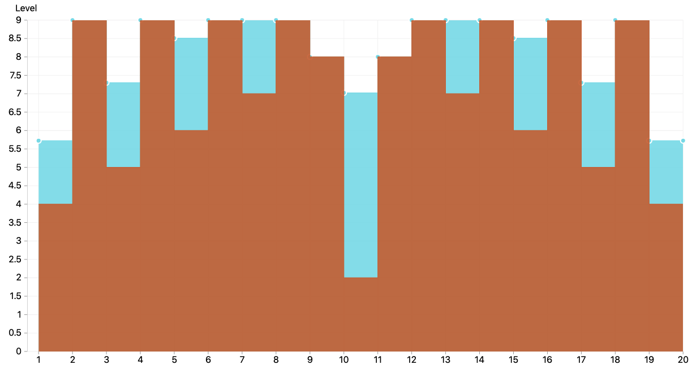

## Development instructions

The source code is hosted in *Github*, where on every push to master, [some Github Actions](.github/workflows/main.yaml) are run, to analyse the code (format and linting), run the tests (mostly unit tests, but also an integration test), build the artifacts (frontend assets, backend binary, and docker image), and deploy to [fly.io]

All the automated processes can be run using the tool [make] and it is configured in a couple of Makefiles ([one global](Makefile), and [the other for the frontend](frontend/Makefile)).

Some of the most used commands are:

- `make local-all` to format, lint and test the code.
- `make run` to run the server locally.
- `cargo watch -x 'test -- --nocapture'` to run the test automatically while you alternate between writing tests and code.
- `make frontend-build` to build the assets for the frontend.
- `fly-deploy` to deploy to fly.io (in real life there should be different environments configured with different API tokens to avoid mistakes)

[fly.io]: https://fly.io/
[make]: https://www.gnu.org/software/make/manual/make.html
