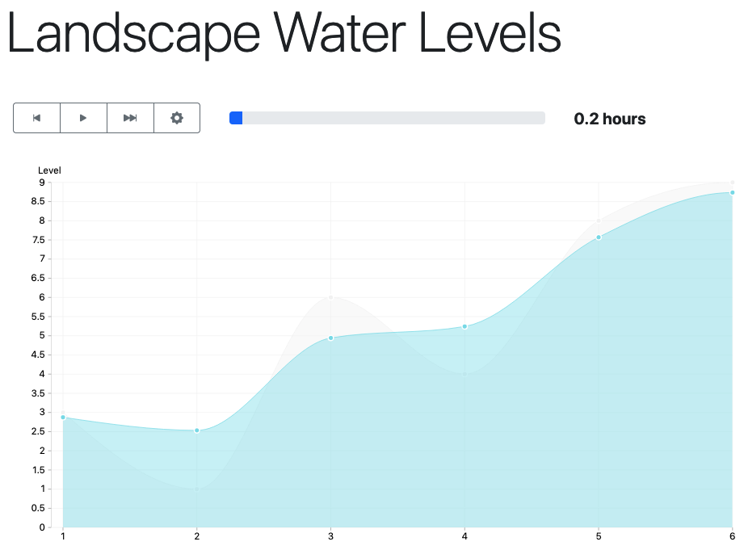
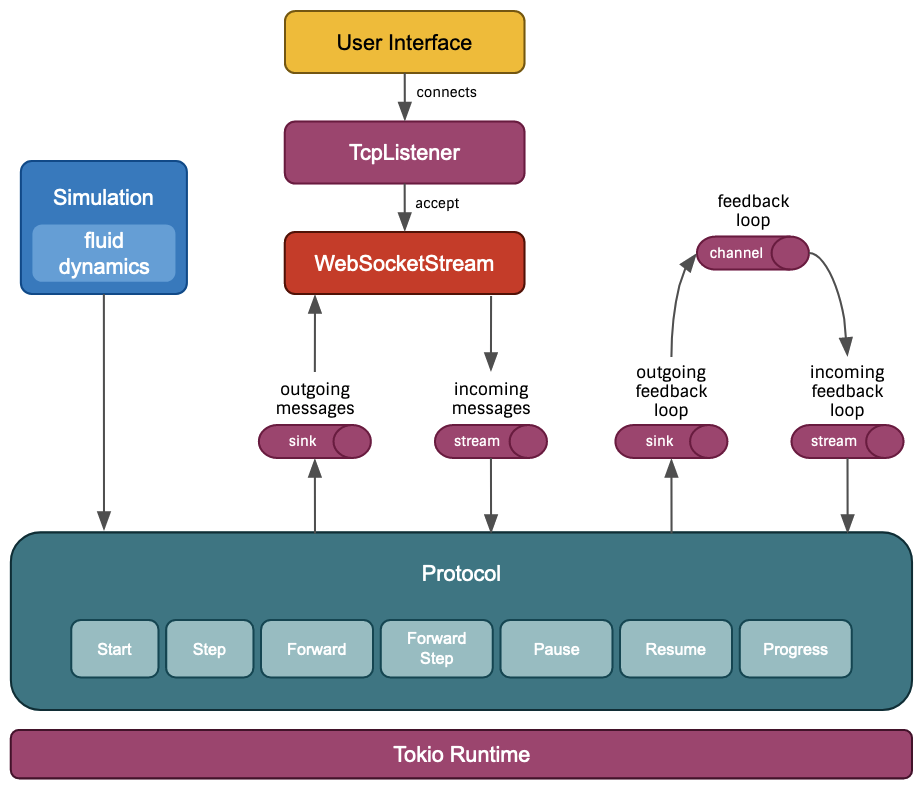
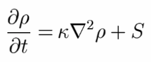
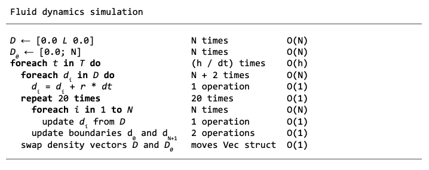

# Landscape Water Levels

## Introduction

This is a web application that simulates the flow of water across different segments of a landscape. The idea is that a user can introduce a comma separated list of water levels and a number of hours to simulate, and start a simulation. The user will see the progress of the simulation and interact with it to pause, continue, or fast forward.

The main goal for me was to put in practice my skills with Rust, and build a WebSocket based service that required interactivity from the users. To that aim I decided to use the great [tokio-tungstenite] crate and leverage concurrency with [tokio], [futures] and `async/await`.

To make the exercise more visual and interactive, I also took the chance to learn a new technology and build a web fronted using [ELM]. Aside from this being the first time in my life working with ELM or writing Haskell code, I am not a professional frontend developer, so please take it with a grain of salt.

[tokio-tungstenite]: https://github.com/snapview/tokio-tungstenite/tree/master/examples
[tokio]: https://tokio.rs/
[futures]: https://docs.rs/futures/0.3.15/futures/
[ELM]: https://elm-lang.org/

## Software design

The application is divided in different parts:

- The **user interface** is a single page application that connects with the server through a WebSocket (see [frontend](frontend)).
- The **networking** part deals with WebSocket connections (see [main.rs](src/main.rs))
- The **protocol** part deals with the user interactions following a simple protocol that allows to start a simulation, pause and resume it, and fast forward it (see [protocol.rs](src/protocol.rs)).
- The **simulation** part encapsulates the simulation logic (see [simulation.rs](src/simulation.rs)).
- The **physics** part deals with the physics related to fluid dynamics (see [physics.rs](src/physics.rs)).

The protocol is abstracted out from the networking by using plain `futures` `Sink`s and `Stream`s that transport messages. To allow easy unit testing of the protocol, the internal events sent to itself (for example to signal that a new step needs to be simulated after a certain period of time) are delegated to a `Sink` and a `Stream`. They are created from a single `mpsc::channel` in runtime, but a couple of different channels for unit testing.

## The algorithm and its complexity

I have dealt with different kind of simulations in the past, and I know that if the differential equations are not properly implemented, they can be very unstable. So before reinventing the wheel I decided to look for existing algorithms, and I found a very simple and intuitive paper explaining how to implement [fluid dynamics for games]. My implementation is a big simplification of it in the following aspects:

- I only use a single dimension, rather than the two explained in the paper.
- I don't use velocities at all, which simplifies the implementation quite a lot. I basically implement the diffusion part, resulting in this simplified equation:

[fluid dynamics for games]: https://www.dgp.toronto.edu/public_user/stam/reality/Research/pdf/GDC03.pdf

The asymptotic computational complexity of the algorithm can be analised simply by looking at the pseudo-code:

**Inputs:**

- **L** = The landscape water levels for all the segments
- **h** = The number of hours to simulate

**Output:**

- The level of the water in the different segments

**Given:**

- r = rain units per hour
- dt = The delta time to use for the integrations (default 0.05)
- T = All the instants between 0 and *h*. |T| = *h* / *dt*
- N = |L| (number of segments in the landscape)
- D = densities representing the levels of water
  

If we follow the longest path of nested iterations we'll get:

`O(h) * O(1) * O(N)`

which results in

`O(h * N)`

We have **quadratic complexity** that depends on the **number of hours** to simulate and the **size of the landscape**.

## Development instructions

The source code is hosted in *Github*, where on every push to master, [some Github Actions](.github/workflows/main.yaml) are run, to analyse the code (format and linting), run the tests (mostly unit tests, but also an integration test), build the artifacts (frontend assets, backend binary, and docker image), and deploy to [fly.io]

All the automated processes can be run using the tool [make] and it is configured in a couple of Makefiles ([one global](Makefile), and [the other for the frontend](frontend/Makefile)).

Some of the most used commands are:

- `make local-all` to format, lint and test the code.
- `make run` to run the server locally.
- `cargo watch -x 'test -- --nocapture'` to run the test automatically while you alternate between writing tests and code.
- `make frontend-build` to build the assets for the frontend.
- `fly-deploy` to deploy to fly.io (in real life there should be different environments configured with different API tokens to avoid mistakes)

[fly.io]: https://fly.io/
[make]: https://www.gnu.org/software/make/manual/make.html
